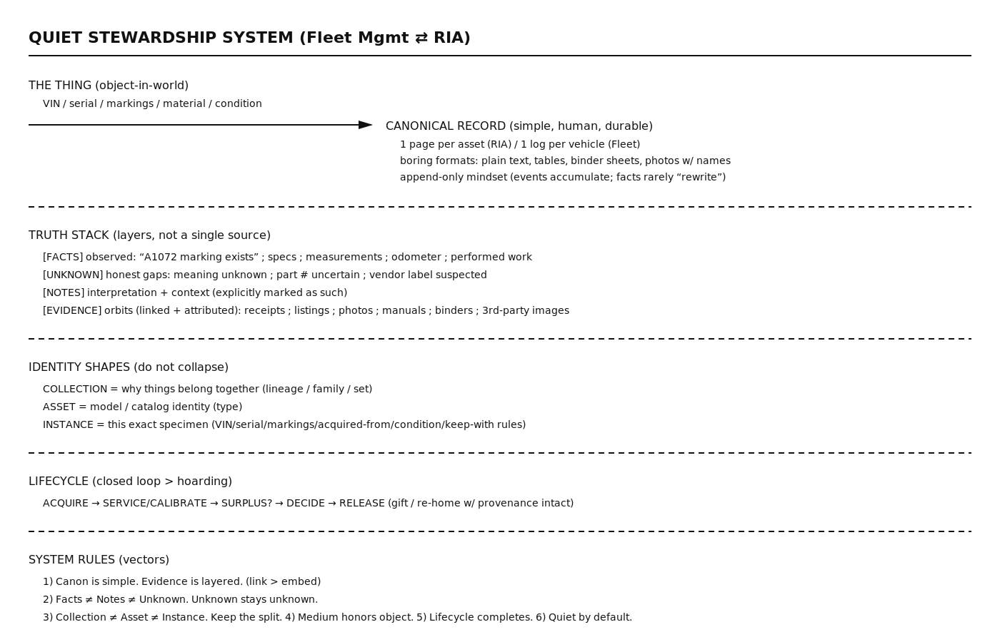

# Rhythm Industries Archive

A working archive documenting components, artifacts, and industrial ephemera produced by Rhythm Industries, a small factory just outside of Cincinnati, Ohio.

The archive exists to preserve reference, context, and continuity — not to speculate or embellish.

→ [Catalog(./catalog/)  
→ See [ORIGIN.md](./ORIGIN.md) for background and context.

## Quiet Stewardship System (Fleet Mgmt ⇄ RIA)

  

