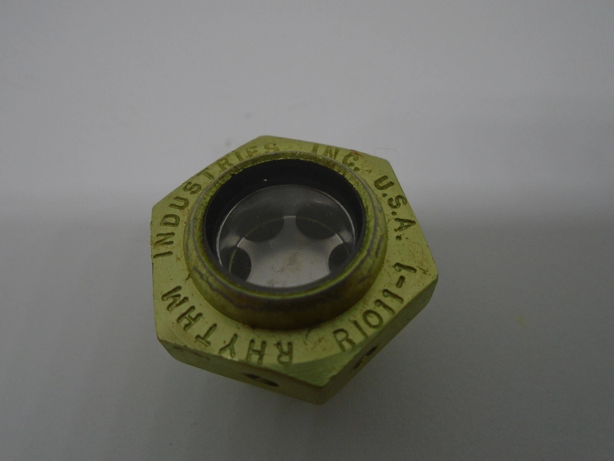

# RI011-1 — Hydraulic / Liquid Sight Glass (3/4"-16 UNF)

3/4″-16 UNF (Fine Thread) · Aluminum · Anodized

<small>Commonly mislisted as “RL011-1” in surplus catalogs.</small>

## Summary

The RI011-1 is a compact hydraulic / liquid sight glass originally manufactured by Rhythm Industries for use in fluid systems requiring visual level or flow confirmation. These parts date to late-20th-century U.S. industrial production and reflect a period when Rhythm Industries supplied robust, no-nonsense components to OEMs and maintenance operations.

This offering comes from surplus inventory and has not been installed or used.

## Provenance

<!-- This is the heart. It should feel like something you’d find folded inside a box — not marketing copy. To be reused verbatim across listings, invoices, or even printed slips. -->

This RI011-1 hydraulic / liquid sight glass is an original Rhythm Industries component acquired from surplus industrial inventory in the United States. The part is physically marked “RI011-1” on the body; variants of this item are sometimes miscataloged as “RL011-1” in secondary listings. Manufactured during Rhythm Industries’ active production era, these units remained unused in storage prior to acquisition. In 2026, a large intact lot was secured to preserve representative examples for the Rhythm Industries Archive and to allow limited redistribution without alteration.

## Specifications

* Thread: 3/4″-16 UNF (fine thread, **not** NPT)
* Thread direction: Right-hand
* Overall height: ~0.740 in (nominal)
* Width across flats: ~1.000 in (nominal)
* Sight diameter: ~0.562 in (nominal)
* Max temperature: 200°F
* Material: Aluminum alloy
* Finish: Anodized

## Availability

Limited surplus stock.
Sold individually.
Each unit inspected visually prior to shipment.

*(No attempt is made to modernize, modify, or rebrand these parts.)*

## Notes

This page exists primarily for documentation and archival continuity.
Availability may change without notice.
